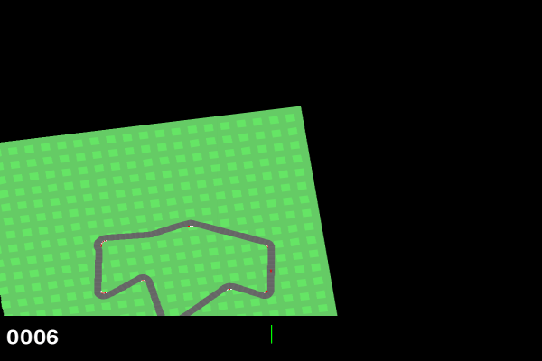

# car_racing using Stable Baselines 3
Train a Gymnasium agent using Stable Baselines 3 and visualise the results.

The code can be used to train, evaluate, visualize, and record video of an agent trained using Stable Baselines 3 with Gymnasium environment.

By default, the agent is using DQN algorithm with Discrete car_racing environment. After 1 million training steps, the agent performance looks like as given
in this [video](https://youtu.be/I8l90e4Ehh4).

**The evaluation metric** after the training is (for 20 episodes):

The mean_reward: 848.3200104500002

The std_reward: 146.44884728379057